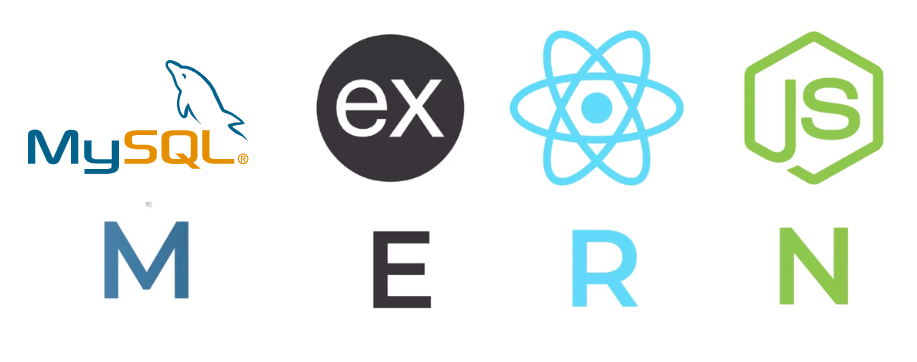

# Bienvenido a SiPeKa Docs  

SiPeKa es un sistema integral para la gestión de planillas, asistencias y sueldos, diseñado especialmente para empresas pequeñas. La plataforma permite administrar de forma eficiente los datos de empleados, registrar asistencias y calcular remuneraciones, simplificando el proceso de generación del archivo .csv requerido por el Sistema de Planilla Única.

## Entorno de desarrollo

- FrontEnd: React.js, Vite, Redux Toolkit, TailwindCSS, ApexCharts, Framer Motion, i18next
- BackEnd: Node.js, Express.js, Sequelize ORM, JWT, Argon2, MySQL
- Base de datos: MySQL
- Quality Assurance: Docker, GitHub, Postman, Jest, GitHub Actions

## Estructura del proyecto  

    mern-employee-salary-management
    ├── Backend
    │   ├── config                  # Configuraciones generales (DB, sesiones, etc.)
    │   ├── controllers             # Controladores de rutas del backend
    │   ├── db
    │   │   ├── db_penggajian3.sql     # Estructura inicial de la base de datos
    │   │   ├── db_scripts.sql         # Scripts de carga y pruebas
    │   │   └── db_scripts_2.sql       # Scripts complementarios adicionales
    │   ├── middleware              # Validaciones, autenticaciones, errores
    │   ├── models                  # Modelos Sequelize para conexión MySQL
    │   ├── routes                  # Definición de endpoints de la API REST
    │   ├── .env.example            # Archivo ejemplo para variables de entorno
    │   └── server.js               # Punto de entrada del backend
    │
    ├── Frontend
    │   ├── public                  # Recursos estáticos (favicon, etc.)
    │   ├── src
    │   │   ├── components          # Botones, tarjetas, gráficas, tablas, etc.
    │   │   ├── pages               # Páginas: empleados, deducciones, asistencias
    │   │   ├── layouts             # Plantillas base con sidebar/topbar
    │   │   ├── hooks               # Hooks personalizados para lógica común
    │   │   ├── store               # Redux Toolkit (slices y store)
    │   │   ├── locales             # Archivos de traducción (i18n)
    │   │   ├── App.jsx             # Enrutamiento general del frontend
    │   │   └── main.jsx            # Punto de arranque de la app React
    │   ├── .env.example            # Variables de entorno del frontend
    │   └── vite.config.js          # Configuración de Vite para desarrollo
    │
    ├── README.md                  # Descripción general del proyecto
    └── INSTALATION.md             # Guía técnica de instalación
