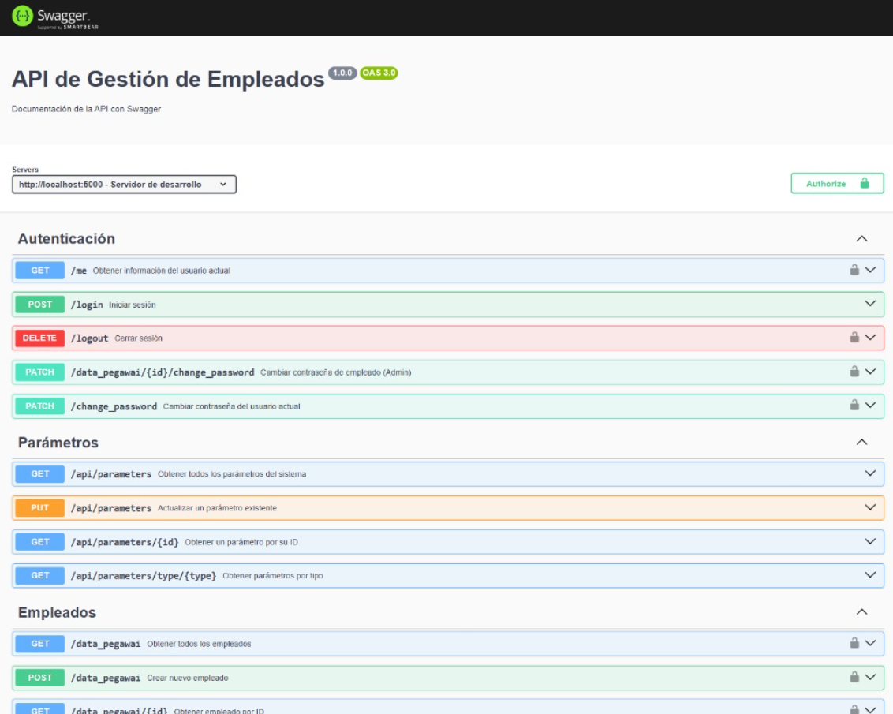

# Manual y Testing de API rest

Swagger es una herramienta que permite visualizar, probar y comprender de forma interactiva los endpoints de la API REST de SiPeKa. Gracias a esta interfaz, cualquier desarrollador puede consultar las rutas disponibles, los parámetros requeridos, los tipos de respuesta y los posibles códigos de error sin necesidad de herramientas externas como Postman.

## ¿Qué puedes hacer desde Swagger?

- Consultar los endpoints disponibles y su propósito.
- Ver los métodos HTTP utilizados (GET, POST, PUT, DELETE).
- Probar directamente la API desde el navegador.
- Enviar parámetros de prueba y observar las respuestas en tiempo real.
- Ver ejemplos de respuestas con estructura JSON.
- Conocer los códigos de estado HTTP posibles para cada petición.

[Manual de API](http://localhost:5000/api-docs)  

