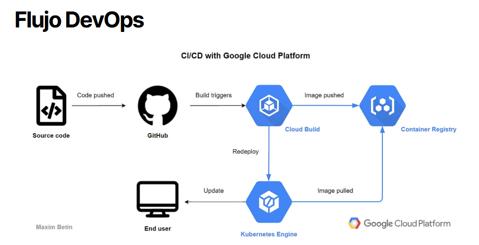

# Manual de instalación DevOps

Este manual describe el proceso de integración y despliegue continuo (CI/CD) del sistema SiPeKa (Sistema de Planillas para Empleados) y como instalarlo, detallando el uso de contenedores Docker, GitHub Actions para automatización, y Google Cloud Platform como infraestructura de ejecución y persistencia de datos. El objetivo es garantizar un flujo de trabajo moderno, automatizado y confiable.

[Manual de instalación DevOps](https://docs.google.com/document/d/1Nl1RxQMVZrTVtuSu1Uy6tzE29s7lgpWSY5Epp9fy6QU/edit?usp=sharing)

## Herramientas DevOps

| Herramienta           | Función                                                       |
|-----------------------|---------------------------------------------------------------|
| GitHub Actions        | CI/CD para pruebas, construcción y despliegue                 |
| Docker                | Contenerización de backend y frontend                         |
| Docker Hub            | Registro remoto de imágenes públicas del sistema              |
| Google Cloud Run      | Despliegue administrado y escalable de servicios Docker       |
| Google Cloud SQL      | Almacenamiento persistente con MySQL, accesible desde Cloud Run|
