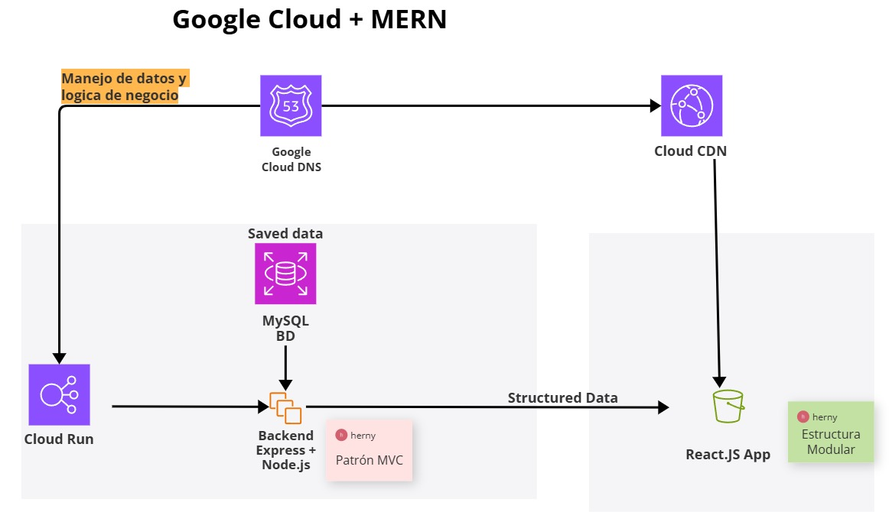

# Manual Técnico

El sistema SiPeKa (Sistema de Planillas para Empleados) es una plataforma basada en el stack MERN (adaptado a MySQL) para la gestión de nómina de empleados. Esta versión prototipo forma parte de un proyecto académico enfocado en instituciones públicas de El Salvador, con funcionalidades clave como el cálculo salarial, autenticación por roles, y exportación de reportes.

## Arquitectura del proyecto

El sistema SiPeKa ha sido desarrollado utilizando una arquitectura basada en el stack MERN adaptado a bases de datos relacionales (MySQL). La solución está preparada para su despliegue en la nube, empleando servicios de Google Cloud como Cloud Run, Cloud CDN y Cloud DNS.

Para consultas de como utilizar los instalar y ejecutar localmente el sistema, consultar el siguiente manual técnico:  

[Manual Técnico](https://docs.google.com/document/d/1PGikT4FXZWtkfCwpIyQ9CxEmx1utbJIQiU7hjdqf7JA/edit?usp=sharing)

### Requisitos del sistema

#### Software

- Node.js (v18 o superior)
- MySQL (v8 o superior)
- Git
- Visual Studio Code
- Navegador moderno (Chrome, Firefox)

#### Hardware

- Procesador: Intel i5 o equivalente
- RAM: 8GB
- Almacenamiento libre: 512MB para entorno de desarrollo
